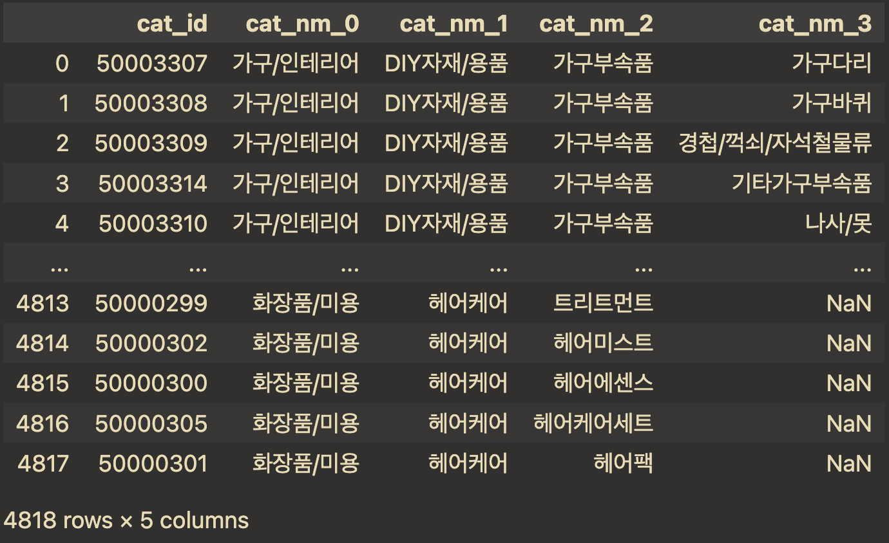

# 네이버 쇼핑 카테고리 ID 데이터

## tl;dr
- 네이버 데이터랩 쇼핑인사이트 api 활용시 필요한 데이터 

## Why?
- 쇼핑 카테고리 ID를 API에서 딱히 제공 안하는듯

## How?
[네이버 블로그](https://m.blog.naver.com/wkftkfdkqhkdy/222768591373)
- 깡으로 그냥 올려두심

- 네이버 블로그 복붙이 좀 힘들어서 프린트해서 만듦

